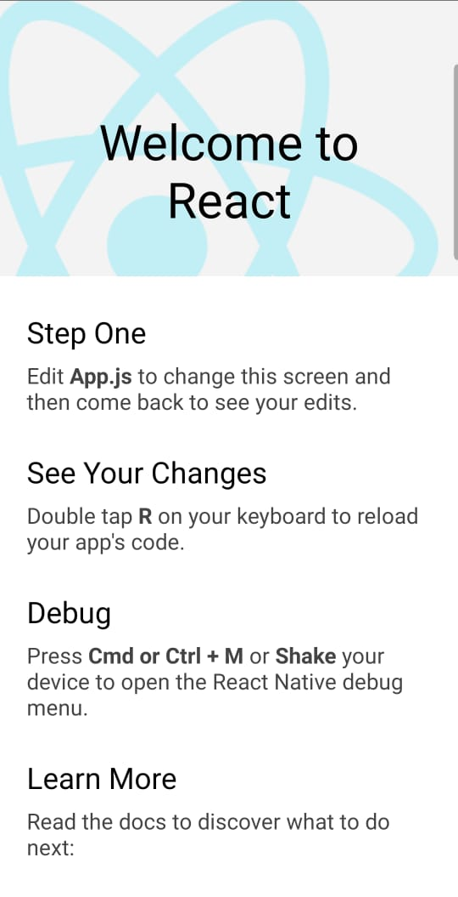

# FIRST REACT NATIVE PROJECT INIT

learn how do I create mobile app using react-native.
1. make sure we have already install android studio
2. run android licensed

## Config
```bash
# create new react project
npx react-native init FirstProject

# run server
npm start

# upload on your devices
npx react-native run-android
```

## VS Code Extensions
- ES7 React
    - 
- Prettier Code Formatter
    - 
- Bracket Pair Colorizer
    - 
- Color Highlight
    - 
- Path Intellisense
    - 
- Code Time 
    - 
- Gitlense
    - 

## Debugging
- facing error
    - 
    - solution: on root project run : `npm start`

- First Pproject App
    - 

## Result
- init project
    - 

## Reference
- [react-nativ-documentation](https://reactnative.dev/)